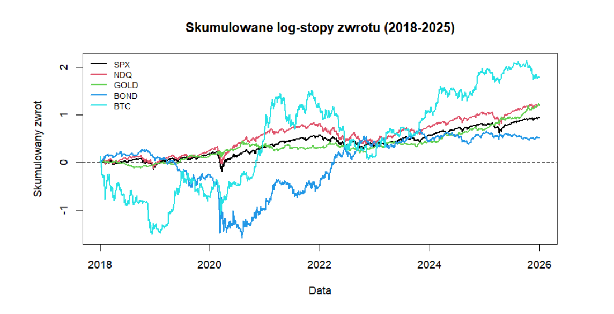
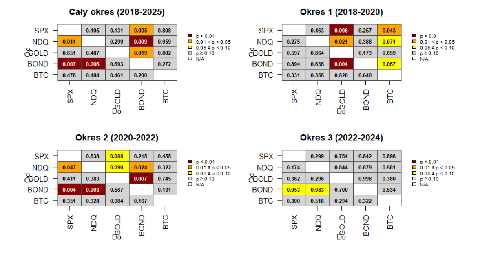
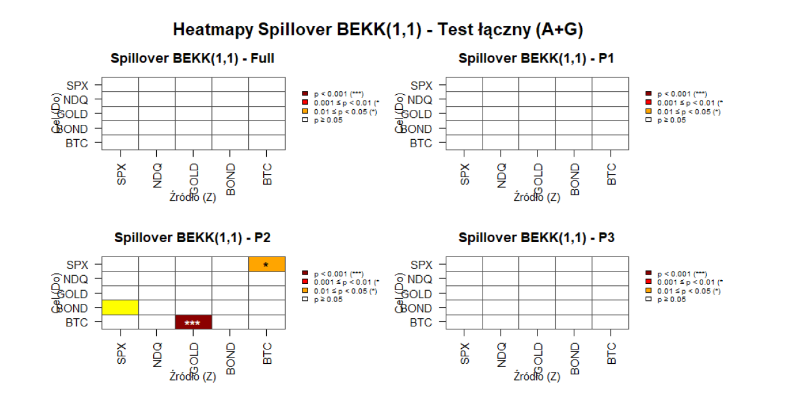
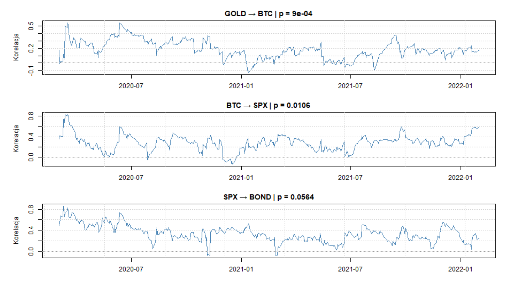

# Financial Interdependence & Volatility Spillover Analysis (2018-2025)

## 📊 Project Overview
This project explores the dynamic linkages and risk transmission mechanisms between five key financial instruments: **S&P 500 (SPX)**, **Nasdaq 100 (NDQ)**, **Gold (GOLD)**, **10-Year US Treasury Bonds (BOND)**, and **Bitcoin (BTC)**. The study covers the period from 2018 to the end of 2025.

### Cumulative Performance
The analysis begins with an overview of relative asset growth, highlighting the exceptional performance of **Bitcoin** and the high correlation between **SPX** and **NDQ** indices.

  

<em>Figure 1: Cumulative log-returns (2018-2025). Relative strength of BTC vs. traditional assets.</em>

## 🛠 Methodology & Tools
The research is divided into two advanced econometric stages:

### Part A: VAR Modeling & Robust Granger Causality
* **Stationarity:** Verified via Augmented Dickey-Fuller (ADF) tests (all series I(0)).
* **Model Selection:** VAR(1) framework based on Hannan-Quinn (HQ) criteria.
* **HAC Robustness:** Use of **Newey-West (HAC)** estimators to correct for autocorrelation and ARCH effects, ensuring valid causal inference.

### Part B: Volatility Spillover (BEKK-GARCH)
* **Risk Transmission:** Full BEKK(1,1) model to identify contagion paths.
* **Dynamic Correlations:** Tracking how linkages "pulse" during market stress.

## 📈 Key Visual Insights

### 1. Market Interdependence (Granger Causality)
A hierarchical structure is identified: the **Bond market** acts as a primary predictor for equities, while the **Nasdaq** serves as a sentiment barometer for the broader S&P 500.

  

<em>Figure 2: Granger causality evolution. Note the massive integration spike during the 2020 pandemic.</em>

### 2. Volatility Spillover & Contagion
The BEKK model reveals that during the pandemic, volatility "infected" markets through specific channels: **Gold → BTC** (short-term shocks) and **BTC → SPX** (persistent risk).

  

### 3. Dynamic Conditional Correlations
Unlike static matrices, this analysis shows how correlations spiked during the COVID-19 crash and exhibited strong persistence (GARCH effect), meaning diversification benefits vanished exactly when they were needed most.

  

<em>Figure 3: Conditional correlations for GOLD-BTC and BTC-SPX. Note the volatility clustering in early 2020.</em>

## 📂 Project Structure
* `interdependence_spillover_analysis.R`: Full R pipeline.
* `/data`: Historical CSV datasets.
* `/docs`: Technical report (Polish) with detailed statistical interpretations.
* `/img`: Visualizations for this documentation.

## 🚀 How to Run
1. Clone this repository.
2. Install dependencies: `quantmod`, `vars`, `BEKKs`, `sandwich`, `lmtest`.
3. Run `interdependence_spillover_analysis.R`.
